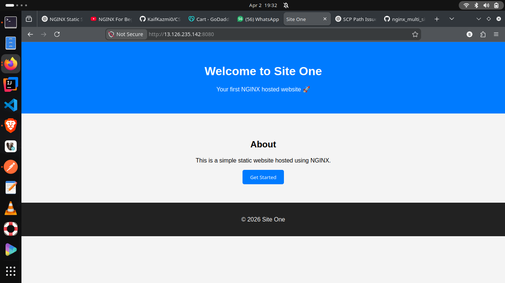
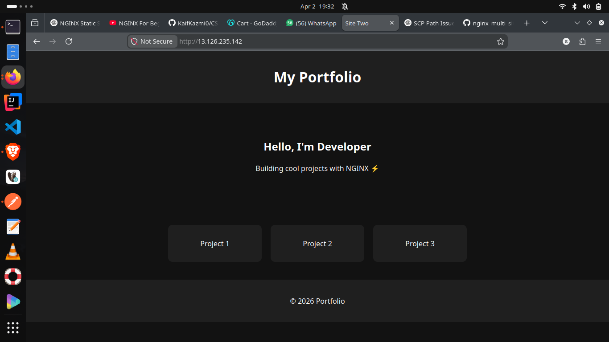
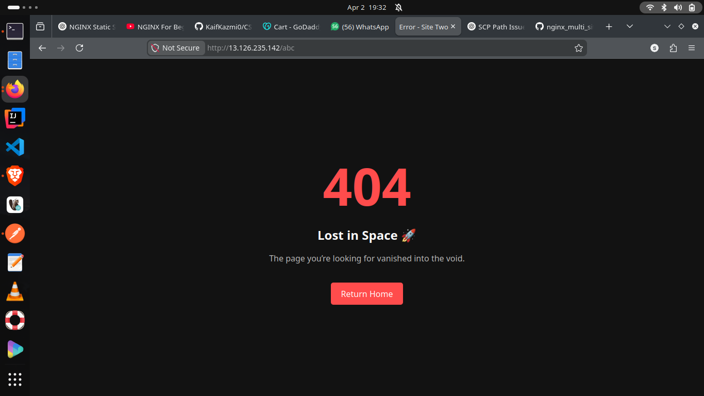
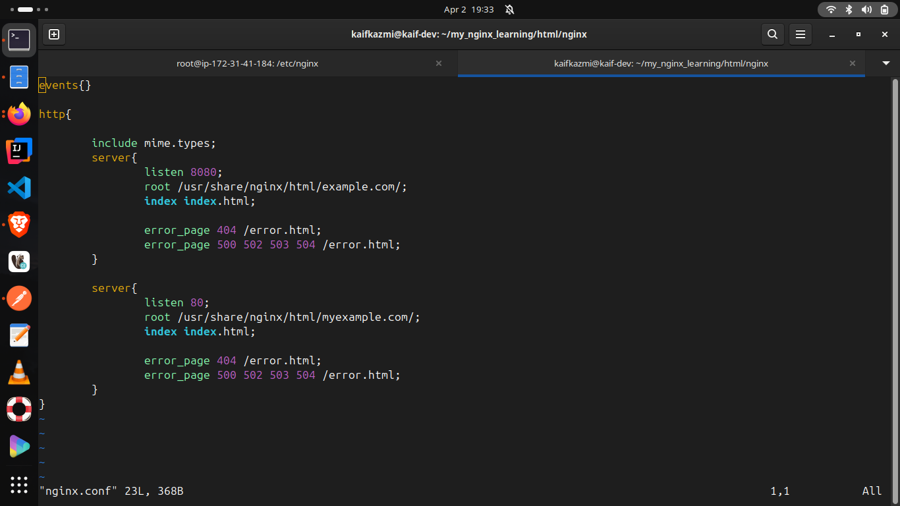

# 🚀 NGINX Multi-Site Hosting Project

## 📌 Overview

This project demonstrates how to host **multiple websites using NGINX** with custom error handling.

## 🌐 Features

* Hosting multiple static websites
* Custom 404 error pages
* NGINX server block configuration
* Clean folder structure

## ⚙️ Tech Stack

* HTML
* CSS
* NGINX
* Ubuntu Linux

## 📂 Project Structure

* `site1/` → First website
* `site2/` → Second website
* `nginx/` → Configuration files

## 🧠 What I Learned

* How NGINX server blocks work
* Reverse proxy basics
* Error handling in NGINX
* Deploying static sites on Linux

## ▶️ How to Run Locally

1. Install NGINX
2. Copy files to `/var/www/`
3. Update `nginx.conf`
4. Restart NGINX:

   ```bash
   sudo systemctl restart nginx
   ```
## 📸 Demo

### 🌐 Site 1


### 🌐 Site 2


### ❌ Error Page


### ⚙️ NGINX Config


## 💡 Future Improvements

* Add HTTPS (Let's Encrypt)
* Add reverse proxy backend
* Dockerize setup
